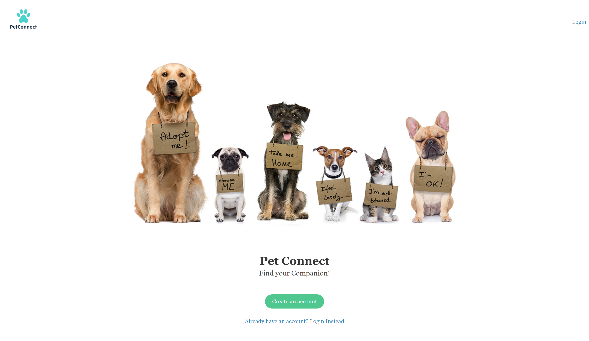

# Pet Rescue Hub

## Welcome to Our Compassionate Community

Welcome to the Pet Rescue Hub, where compassion meets companionship. Our website is a dedicated platform committed to connecting loving families with adoptable pets in need of a forever home. We believe in the power of adoption and the profound impact it can have on both the lives of animals and their human companions. By choosing to adopt, you not only gain a loyal companion but also contribute to creating a world where every pet has a loving home.

## Technologies Used

- **Node.js and Express.js:** We use Node.js as our server-side JavaScript runtime and Express.js as our web application framework to create a robust and efficient RESTful API.

- **Handlebars.js:** As our templating engine, Handlebars.js allows us to dynamically generate HTML content, providing a seamless and interactive user experience.

- **MySQL and Sequelize ORM:** Our choice of database technology is MySQL, and we utilize the Sequelize ORM (Object-Relational Mapping) to interact with the database. This combination ensures a reliable and scalable data storage solution for our pet profiles and user information.

## Folder Structure (MVC Paradigm)

Our application follows the Model-View-Controller (MVC) paradigm to organize and structure the codebase for clarity and maintainability. Here's an overview of our folder structure:

- **models:** Contains database models defined using Sequelize, representing the data structure of our application.

- **views:** Houses Handlebars.js templates responsible for rendering dynamic HTML content.

- **controllers:** Manages the application's business logic, handling user requests and interacting with the models to update the database.

- **public:** Stores static assets such as stylesheets, images, and client-side scripts.

- **routes:** Defines the routes and endpoints of our RESTful API, directing incoming requests to the appropriate controllers.

- **config:** Holds configuration files for database connections, API keys, and other environment-specific settings.

## Features

### Browse Heartwarming Profiles

Explore heartwarming profiles of rescue animals searching for their forever homes. Each profile provides detailed information about the pet's personality, history, and any special needs they may have. Our goal is to make the adoption process as transparent and informed as possible, ensuring that families and pets are well-matched for a lifetime of happiness.

### Find Your Perfect Furry Friend

Use our intuitive search and filtering options to find the perfect furry friend that fits your lifestyle and preferences. Whether you're looking for a playful pup, a cuddly kitten, or a more seasoned companion, our Pet Rescue Hub has a diverse range of animals waiting to become a cherished part of your family.

### Adopt, Don't Shop!

At the Pet Rescue Hub, we strongly advocate for adopting pets rather than shopping. By choosing adoption, you are not only providing a loving home to a pet in need but also supporting the broader mission of reducing the number of homeless animals. Join us in promoting responsible pet ownership and making a positive impact on the lives of our furry friends.

## How to Get Started

1. **Browse Profiles:** Explore our collection of adoptable pets by browsing through their profiles.

2. **Filter Search:** Use our search and filtering options to narrow down your choices based on criteria such as species, age, size, and more.

3. **Contact Rescues:** Reach out to the respective rescue organizations to learn more about the pets you are interested in and to initiate the adoption process.

4. **Adopt with Confidence:** Make a difference in a pet's life by choosing to adopt. Enjoy the rewarding experience of bringing a new member into your family.

## Support and Contact

If you have any questions, concerns, or need assistance, feel free to reach out to our support team at support@petrescuehub.com.

Thank you for choosing the Pet Rescue Hub. Together, let's create a world where every pet has a loving and forever home. Adopt, don't shop!

## Deployed Site

Link to deployed application: https://pet-connect-1eeb45c85753.herokuapp.com/